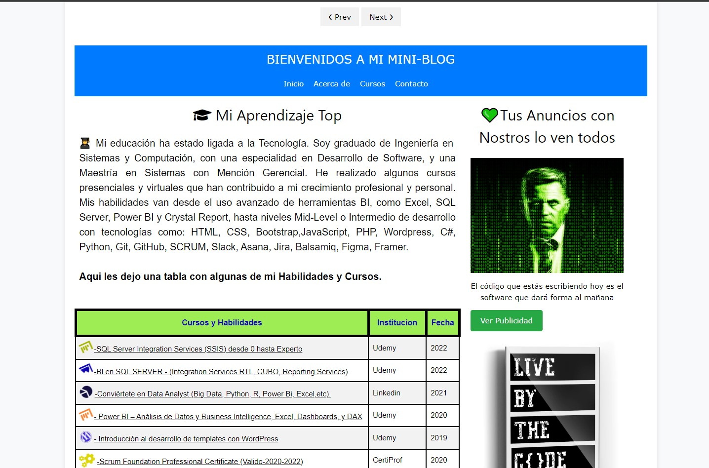

# SEPTIMO_PROYECTO_MINI_BLOG_TODO

¡Bienvenido a mi Mini Blog!

Este es mi séptimo proyecto, un Mini Blog diseñado con HTML y CSS. Aquí encontrarás información sobre el proyecto y cómo puedes utilizarlo.

## Descripción del Proyecto

Este Mini Blog está diseñado como un sitio web simple con varias páginas. Cada página tiene su propia sección en la barra de navegación y contiene contenido relacionado con el tema del blog.

## Contenido

- [Inicio](index.html): Página de inicio del Mini Blog.
- [Acerca de](acerca.html): Información sobre el autor del blog.
- [Cursos](cursos.html): Listado de cursos disponibles.
- [Contacto](contactos.html): Información de contacto para el autor.

### CAPTURAS DE PANTALLA:

### Link pagina Web: https://juancitopena.github.io/SEPTIMO_PROYECTO_MINI_BLOG_TODO/contactos.html

## Uso

Puedes clonar este repositorio o descargar los archivos directamente. Luego, puedes abrir los archivos HTML en tu navegador web para ver el Mini Blog en acción.

## Contribuciones

Siéntete libre de contribuir mejorando este proyecto. Puedes crear solicitudes de extracción para agregar nuevas características o solucionar problemas.

## Licencia

Este proyecto está bajo la Licencia MIT. Consulta el archivo [LICENSE](LICENSE) para obtener más detalles.

---

Espero que este README te sea útil para presentar tu proyecto en GitHub. Puedes personalizarlo según las necesidades específicas de tu proyecto. ¡Buena suerte!
